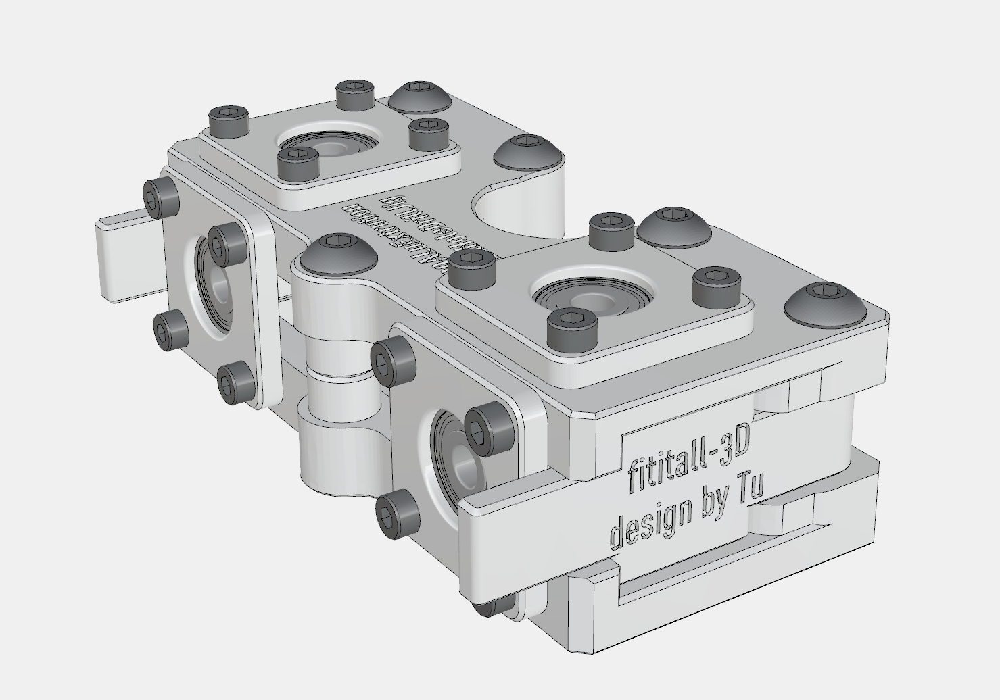
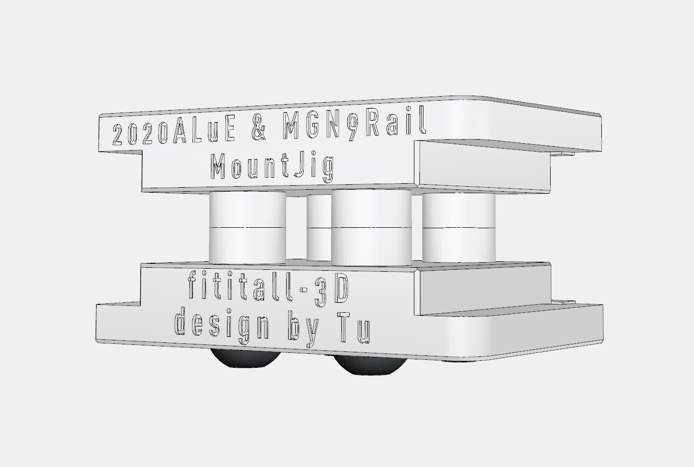

#### 04日
上传开源项目介绍视频，算是fititall Cube300和CrossingXZ的官宣了。

#### 05日
评论由很多人对于CrossingXZ的运动稳定性与速度疑问，还有一位网友对开发过程感到好奇，于是就想把将开发进度做成了视频。

#### 06日
上传了视频，fititall Cube300由来——8年3D打印机用户的个人需求，同时着手准备开源文档的整理工作。
开源文档分为两大部分：
- 用户指导手册
- 模型文件整理

这两部分相辅相成，必须同时展开，而展开之前，需要确定一个工作抓手————以创客作为核心用户。

- 创客们具备一定的机械装配技能，但水平参差不齐，可设计安装辅助工具提升装配精度；
- 创客对于安装顺序较为敏感，要求较高，安装步骤尽可能细化，尽可能增加安装步骤的节点，减少返工的可能性与返工的难度；

对此，工作内容可分为如下几个步骤：
1. 整理视频版本的文件；
2. 将多余的线条、无关的杂项模型删除，减少未来发布文档中的STP文件中的“无用项”；
3. 修改、添加必要的零件与紧固件，便于制作安装图示；
4. 发布；

#### 07日

用户手册必须建立在一个有效文件的整理之上。但是整理用户手册与设计的逻辑有很大差异，设计是以我自己的角度开始展开，是一点一点将内容逐渐建立起来的。而用户则完全不同，他们面对的是一个具体的存在，所以应当建立一条路径，引导他们了解CUbe300的特点，不同结构相互配合的机制，以便将来使用的过程中，出现问题，也能很快找到问题的根源。

但这个工作需要从头再来。

#### 08日

规划了用户文档的架构

#### 09日
设计了辅具

2020型材打孔工具

2020型材与MGN9安装辅具

#### 10、11日
完善型材与MGN9导轨安装辅具型材盲孔辅具的3D模型，并制作打印。
根据使用效果制作了两个设计的用户手册。

#### 12日
划分不同模块模型。

#### 14、15、16日
拍摄两款治具的视频素材，制作剪辑介绍视频。